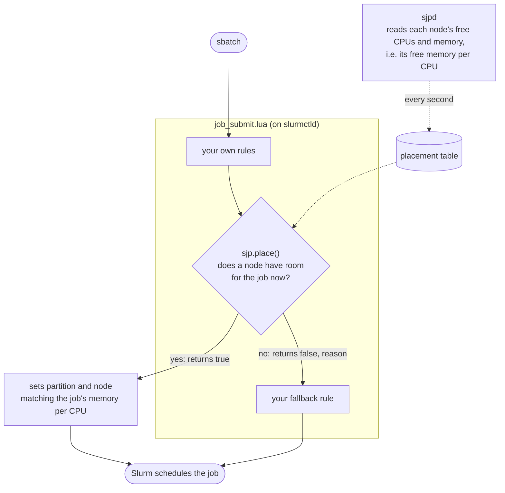

# slurmjobpacker

Slurm plugin for automatic partition and compute node selection that packs jobs optimally on shared compute nodes (i.e. nodes that run multiple jobs concurrently). It does so by matching the memory:CPU ratio of each job to what is currently available on the nodes, reducing waste from starvation of either CPUs or memory.

## The problem with sharing nodes

A computing cluster configured so that nodes can be shared by multiple jobs at once is often preferred over exclusive node access for smaller, local clusters, because it can use computing resources more efficiently. To take proper advantage of this, users must both request resources that match their jobs' requirements as precisely as possible and avoid getting in the way of future jobs. Choosing the most appropriate hardware partition is challenging for many users, and many get it wrong, which wastes computing resources and defeats the purpose of sharing nodes altogether. **The goal of `slurmjobpacker` is BOTH to automate partition and node selection AND to pack the cluster as tightly as possible**, to optimize resource utilization on clusters where nodes are shared among many users.


To pack a cluster efficiently when compute nodes run many jobs simultaneously, the combined CPU and memory shape of the jobs on each node is very important. If the jobs on a node use significantly more memory per CPU on average than the node provides, the memory runs out first and the remaining CPUs sit idle. For example, a node with 256 allocatable threads and 1 TB of memory has at most 4 GB per thread, so the combined requirements of all jobs running on it should preferably match that ratio. Similarly, placing jobs that need little memory per CPU on nodes with extra memory, which are often much more expensive (especially in 2026!), can prevent memory-demanding jobs from running there. Lastly, jobs with low and high memory-per-CPU requirements sometimes fit perfectly together on the same node, so a [job submit Lua script](https://slurm.schedmd.com/job_submit_plugins.html) that assigns partitions based only on a fixed memory-per-CPU threshold (e.g. a fat node above x GB per CPU, otherwise a slim node) is not ideal either.

`slurmjobpacker` takes the memory per CPU each job asks for, considers the free space on all nodes at once, and chooses the placement that leaves the most usable room for the jobs that typically follow. This packs the cluster far better than leaving placement to users and Slurm alone.

## How it works

A daemon, `sjpd`, reads the cluster every second. A small Lua module, `sjp.lua`, is
called from your `job_submit.lua` and places each batch job when it is submitted:

- it chooses the partitions where the job fits the free space best;
- if the job can start now, it also chooses the node (in the highest `PriorityTier`
  partition with room, the node whose free memory per CPU best matches the job's);
- it returns `true` when it placed the job, or `false` and a reason (e.g. `"no room"`)
  when it could not, leaving the job untouched. Your script decides what to do then,
  e.g. apply its own fallback rule (see [Using sjp from job_submit.lua](#using-sjp-from-job_submitlua)).



Slurm still schedules, orders the queue and applies fair-share. Optionally, `sjpd` also
widens the partitions of sjp's jobs that have waited long, and briefly lifts per-user CPU
caps when jobs held only by those caps would fit on idle nodes.

## Installation

Needs Python 3.11+ (standard library only). Tested on Slurm 26.05.

```sh
sudo git clone https://github.com/kasperskytte/slurmjobpacker /opt/slurmjobpacker
cd /opt/slurmjobpacker && python3 tests/test_policy.py        # ends in ALL PASS
```

**Try it without changing anything.** As your own user:

```sh
python3 -m sjp.daemon --dry-run --state-dir ~/sjp-dry
tail -f ~/sjp-dry/sjp.log                                      # in another terminal
```

The log shows, for each new job, where Slurm put it and where sjp would have, and why.

**Run the service.**

```sh
sudo mkdir -p /etc/sjp
python3 -m sjp.daemon --print-config | sudo tee /etc/sjp/sjp.toml
sudo cp systemd/sjpd.service /etc/systemd/system/
sudo systemctl daemon-reload && sudo systemctl enable --now sjpd
```

It starts in `observe` mode: it only reads the cluster and logs what it would do. Set
`mode` in `sjp.toml` and restart `sjpd` to go further:

| mode | chooses partitions | pins nodes, widens long waits | lifts CPU caps |
|---|---|---|---|
| `observe` (default) | no | no | no |
| `advise` | yes | no | no |
| `enforce` | yes | yes | if `[limits] mode = "global"` |

## Using sjp from job_submit.lua

Set `JobSubmitPlugins=lua` in `slurm.conf`. Load `sjp.lua` once at the top of your
`job_submit.lua`, and call `sjp.place()` where you choose a batch job's partition:

```lua
local ok, sjp = pcall(dofile, "/opt/slurmjobpacker/lua/sjp.lua")
if not ok then sjp = nil end        -- without sjp, your own rules still apply

function slurm_job_submit(job_desc, part_list, submit_uid)
    -- your own rules first: reservations, GPU jobs, interactive jobs, ...

    if sjp and sjp.place(job_desc, submit_uid) then
        return slurm.SUCCESS         -- placed by sjp
    end

    -- not placed: your fallback, for example by memory per CPU
    job_desc.partition = "slim1,slim2"
    return slurm.SUCCESS
end
```

Then run `scontrol reconfigure` (again after every sjp upgrade). If you have no
`job_submit.lua` yet, copy [`lua/job_submit.lua`](lua/job_submit.lua) next to
`slurm.conf` and set the few variables at its top.

`sjp.place()` never rejects a job. It returns `true` when it placed the job, or `false`
and a reason when it left the job untouched:

| reason | meaning |
|---|---|
| `"no room"` | no node that could hold the job has room for it right now |
| `"no table"` | `sjpd` is not running, or `/etc/sjp/disable` exists |
| `"stale"` | `sjpd` has not updated its data in the last few seconds |
| `"not batch"` | an interactive job (`salloc`, `srun`) |
| `"gpu"` | the job asks for GPUs |
| `"reservation"` | the job runs in a reservation |
| `"no memory"` | the job asks for all of a node's memory (`--mem=0`) |
| `"error"` | something went wrong; the error is in the `slurmctld` log |

Use the reason if you want different fallbacks, for example:

```lua
local placed, why = sjp.place(job_desc, submit_uid)
if not placed and why == "no room" then ... end
```

A placed job is marked `sjp:...` in its `AdminComment`.

**Turning it off.** `sudo touch /etc/sjp/disable` makes `sjp.place()` return `false` from
the next submission, so only your own rules apply.

## Analysing your own cluster

`tools/` replays and measures your accounting history, without touching Slurm:

```sh
bzcat slurm_acct_db_backup.bz2 > dump.sql                    # a mysqldump of slurm_acct_db
python3 tools/dump2sqlite.py dump.sql accounting.sqlite --cluster <ClusterName>
python3 tools/normalize.py accounting.sqlite
cp tools/site.example.toml site.toml                          # describe your partitions
python3 tools/stranding.py accounting.sqlite                  # stranded CPU-hours
python3 tools/simulate.py --db accounting.sqlite --start 2026-03-09 --days 14
```

## Development

```sh
python3 tests/test_policy.py          # unit tests
tests/testcluster.sh start            # throwaway slurmctld as your user
export SLURM_CONF=/tmp/sjp-cluster/slurm.conf
python3 -m sjp.daemon -c /tmp/sjp-cluster/sjp.toml
tests/testcluster.sh stop
```

Releases are made by [release-please](https://github.com/googleapis/release-please) from
[Conventional Commits](https://www.conventionalcommits.org/): `fix:` for a patch, `feat:`
for a minor release.
